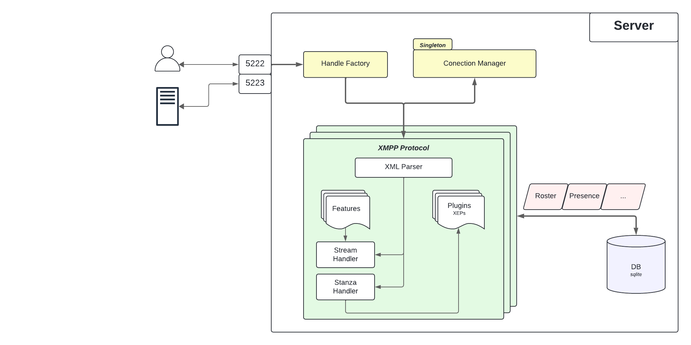

============
Architecture
============

|
| A PyJabber Server is builded by an asyncio loop, with an unique XMPPProtocol object instanced and asociated 
    by each TCP conection made. 
| An instance of Server will have an unique (Singleton) instance of a ConectionManager object. This will keep an unique list of Peers
    conected to the server, and will be visible (but no modificable) for each XMPPProtocol instance.

Client Stream
-------------
#. TCP connection: 
    A client connects by host:5222. PyJabber will create an **XMPPProtocol** instance for this new connection, 
    bound it and store it in the **ConectionManager** singleton
#. Stream Negotiation: 
    Client and PyJabber will start an XML message flow in order to stablish the session. 
    This steep includes the process of securing the socket (startTLS), authentication/registration of the 
    client and its resource binding. This step will be managed by the **StreamHandler**.
#. Stanza Management: 
    After the stream has been negotiated, a session will be started between 
    server and client, and stanzas will be treated by the **StanzaHandler**. This stage is where the mayority 
    of the application will be, and stanzas of **IQ**, **PRESENCE** and **MESSAGE** are treated.
    